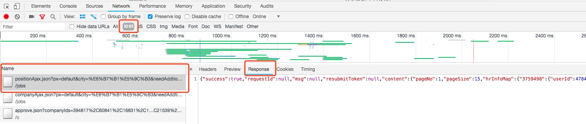

### <center>使用json方法爬取动态网站</center>

> 本章节直接分析拉勾网的`ajax`请求获取职业信息,然后进行抓取下来

### 一、分析网页数据请求



### 二、使用`requests`库直接模拟请求数据

```py
from urllib import parse
import requests

def get_html():
    """
    定义一个函数获取拉钩职位信息
    :return:
    """
    params = {
        'px': 'default',
        'city': '深圳',
        'needAddtionalResult': 'false'
    }
    url = 'https://www.lagou.com/jobs/positionAjax.json?{0}'.format(parse.urlencode(params))
    form_data = {
        'first': 'true',
        'pn': '1',
        'kd': 'python',
    }
    headers = {
        'Accept': 'application/json, text/javascript, */*; q=0.01',
        'Accept-Encoding': 'gzip, deflate, br',
        'Accept-Language': 'zh-CN,zh;q=0.9',
        'Connection': 'keep-alive',
        'Content-Length': '25',
        'Content-Type': 'application/x-www-form-urlencoded; charset=UTF-8',
        'Cookie': 'JSESSIONID=ABAAABAAAGFABEFF0428531C82A2DC0C1C0DCAE2CA9FABE; _ga=GA1.2.484492928.1537518656; _gid=GA1.2.808273883.1537518656; _gat=1; Hm_lvt_4233e74dff0ae5bd0a3d81c6ccf756e6=1537518657; user_trace_token=20180921163056-a947353a-bd78-11e8-a518-525400f775ce; LGSID=20180921163056-a9473670-bd78-11e8-a518-525400f775ce; PRE_UTM=; PRE_HOST=; PRE_SITE=; PRE_LAND=https%3A%2F%2Fwww.lagou.com%2F; LGUID=20180921163056-a9473875-bd78-11e8-a518-525400f775ce; TG-TRACK-CODE=index_search; LGRID=20180921163107-af919ae7-bd78-11e8-bb56-5254005c3644; Hm_lpvt_4233e74dff0ae5bd0a3d81c6ccf756e6=1537518667; index_location_city=%E6%B7%B1%E5%9C%B3; SEARCH_ID=a81f58b5627b460b8180ad514b967cf1',
        'Host': 'www.lagou.com',
        'Origin': 'https://www.lagou.com',
        'Referer': 'https://www.lagou.com/jobs/list_python?px=default&city=%E6%B7%B1%E5%9C%B3',
        'User-Agent': 'Mozilla/5.0 (Macintosh; Intel Mac OS X 10_13_2) AppleWebKit/537.36 (KHTML, like Gecko) Chrome/68.0.3440.106 Safari/537.36',
        'X-Anit-Forge-Code': '0',
        'X-Anit-Forge-Token': 'None',
        'X-Requested-With': 'XMLHttpRequest',
    }
    response = requests.post(url=url, data=form_data, headers=headers)
    print(response.status_code)
    print(response.json())

if __name__ == '__main__':
    get_html()
```
