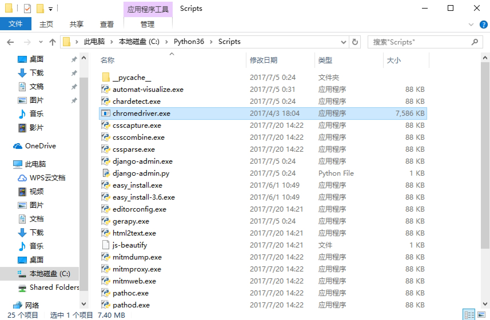
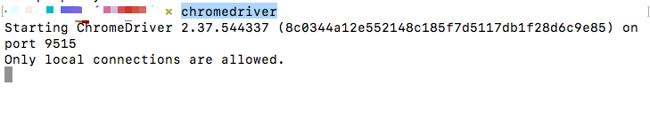

### <center>关于Selenium的基本介绍及环境的安装</center>

> `Selenium`相当于是一个机器人。可以模拟人类在浏览器上的一些行为，自动处理浏览器上的一些行为，比如点击，填充数据，删除`cookie`等。详情请参考[中文文档](https://selenium-python-zh.readthedocs.io/en/latest/),在实际使用过程中需要安装浏览器,`chromedriver`是一个驱动Chrome浏览器的驱动程序，使用他才可以驱动浏览器。当然针对不同的浏览器有不同的`driver`。以下列出了不同浏览器及其对应的`driver`：

* [Chrome](https://sites.google.com/a/chromium.org/chromedriver/downloads)
* [Firefox](https://github.com/mozilla/geckodriver/releases)
* [Edge](https://developer.microsoft.com/en-us/microsoft-edge/tools/webdriver/)
* [Safari](https://webkit.org/blog/6900/webdriver-support-in-safari-10/)

### 一、基础的环境搭建

* 1、安装`selenium`包

  ```py
  pip3 install selenium
  ```
* 2、本人更喜欢使用谷歌浏览器就直接安装`chromedriver`,别的`driver`就不安装了(直接点击上面的链接下载)
* 3.在`Windows`下，建议直接将`chromedriver.exe`文件拖到`Python`的`Scripts`目录下如图(建议这样操作,不然每次都要指定`chromedriver.exe`的地址很麻烦的)

  

* 4.`mac`电脑或者`linux`系统下可以这样操作
  * 1.将刚刚下载的文件移动到`/usr/bin`目录下面

    ```py
    sudo mv chromedriver /usr/bin
    ```
  * 2.配置环境变量

    ```py
    vim ~/.profile
    export PATH="$PATH:/usr/local/chromedriver"
    ```
  * 3.保存后执行命令

    ```py
    source ~/.profile
    ```
* 5、测试是否安装成功(在黑窗口中输入)

  ```py
  chromedriver
  ```

  


### 二、在`python`代码中测试

```py
from selenium import webdriver

browser = webdriver.Chrome()  # 这个地方不指定路径是之前我们配置到了环境变量中
browser.get('https://www.baidu.com')

# 获取到输入框,模拟浏览器输入 python 搜索词
input = browser.find_element_by_id('kw')
input.send_keys('Python')

# 获取到按钮,模拟浏览器点击
btn = browser.find_element_by_id('su')
btn.click()
```
