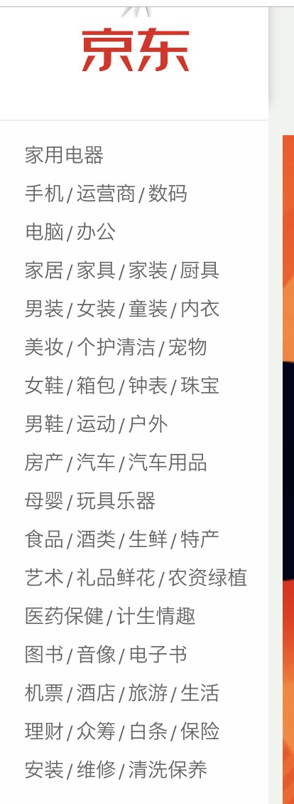

### <center>selenium的查找元素</center>

### 一、关于不同浏览器的打开方式

* 1、谷歌浏览器

  ```py
  from selenium import webdriver
  browser = webdriver.Chrome()
  ```

* 2、火狐浏览器

  ```py
  from selenium import webdriver
  browser = webdriver.Firefox()
  ```

* 3、`IE`浏览器

  ```py
  from selenium import webdriver
  browser = webdriver.Edge()
  ```

* 4、`Safari`浏览器

  ```py
  from selenium import webdriver
  browser = webdriver.Safari()
  ```

* 5、无界面`PhantomJS`中使用

  ```py
  from selenium import webdriver
  browser = webdriver.PhantomJS()
  ```

### 二、关于打开与关闭

* 1、打开浏览器

  ```py
  from selenium import webdriver
  browser = webdriver.Chrome()
  browser.get('https://www.baidu.com')
  ```

* 2、关闭

  ```py
  browser.close()：关闭当前页面。
  browser.quit()：退出整个浏览器。
  ```

### 三、查找元素

* 1、`find_element_by_id()`根据`id`来查找某个元素

  ```py
  browser.find_element_by_id('dom')
  ```

* 2、`find_element_by_class_name()`根据类名来查询某元素

  ```py
  browser.find_element_by_class_name('dom')
  ```

* 3、`find_element_by_name()`根据`name`属性的来查找元素(常见`input`输入框上)

  ```py
  browser.find_element_by_name('username')
  ```

* 4、`find_element_by_tag_name()`根据标签名来获取

  ```py
  browser.find_element_by_name('div')
  ```

* 5、`find_element_by_xpath()`可以使用`xpath`语法来查找

  ```py
  browser.find_element_by_xpath('//div[@class="div1"]')
  ```

* 6、`find_element_by_css_selector()`根据`css`来获取

  ```py
  browser.find_element_by_css_selector('#div1') # 查找id="div1"的元素 
  ```
* 7、**<font color="#f00">多节点的获取</font>**

  要注意,`find_element`是获取第一个满足条件的元素。`find_elements`是获取所有满足条件的元素。

* 8、推介使用`find_element_by_xpath`或者`find_element_by_css_selector`
* 9、使用`find_element`来查找节点

  ```py
  from selenium.webdriver.common.by import By
  browser.find_element(By.CSS_SELECTOR, '#div1') # 根据id查找
  browser.find_element(By.ID,'div1') # 根据id查找
  browser.find_element(By.CLASS_NAME,'su') # 根据class查找
  browser.find_element(By.NAME,'email') # 根据name查找
  browser.find_element(By.TAG_NAME,'div')
  browser.find_element(By.XPATH,'//div')
  ```

### 四、使用`selenium`获取京东购物商城左侧导航

* 1、需要爬取的数据

  

* 2、使用`selenium`抓取数据

```py
```
