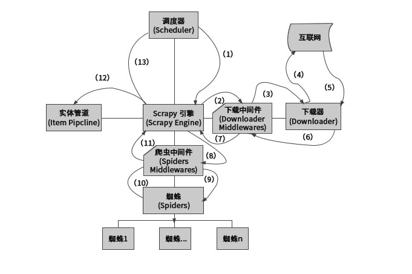

### 
scrapy的介绍

### 一、关于`scrapy`的介绍

* 1、`Scrapy Engine`(引擎):`Scrapy`框架的核心部分。负责在`Spider`和`ItemPipeline`、`Downloader`、`Scheduler`中间通信、传递数据等。
* 2、`Spider`(爬虫):发送需要爬取的链接给引擎，最后引擎把其他模块请求回来的数据再发送给爬虫，爬虫就去解析想要的数据。这个部分是我们开发者自己写的，因为要爬取哪些链接，页面中的哪些数据是我们需要的,都是由程序员自己决定。
* 3、`Scheduler`(调度器):负责接收引擎发送过来的请求,并按照一定的方式进行排列和整理,负责调度请求的顺序等。
* 4、`Downloader`(下载器):负责接收引擎传过来的下载请求,然后去网络上下载对应的数据再交还给引擎。
* 5、`Item Pipeline`(管道):负责将`Spider`(爬虫）提取出来的`Item`(典型的处理数据)。
* 6、`Downloader Middlewares`(下载中间件):下载器中间件是在引擎及下载器之间特定的钩子,处理`Spider`的输入和输出,可以扩展下载器和引擎之间通信功能的中间件。
* 7、`Spider Middlewares`(`Spider`中间件):`Spider`中间件是在引擎及`Spider`之间的特定钩子,处理`Spider`的输入和输出,可以扩展引擎和爬虫之间通信功能的中间件。

### 二、关于`scrapy`的数据流

