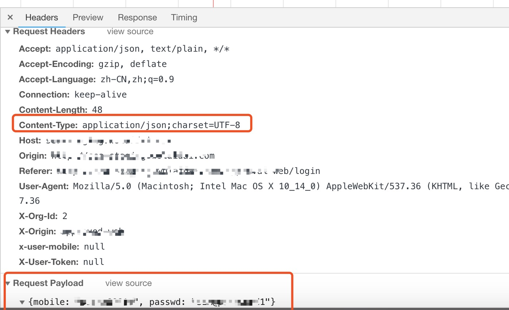

## <center>使用scrapy进行模拟登录(二)</center>

> 上一章节的登录方式均是`form`的方式提交的,当你遇到`request payload`的时候就不可以模拟登录

### 一、关于`request payload`特点




### 二、关于`scrapy`的`FormRequest`源码分析

* 1、官方源码

  ```py
  class FormRequest(Request):

      def __init__(self, *args, **kwargs):
          formdata = kwargs.pop('formdata', None)
          if formdata and kwargs.get('method') is None:
              kwargs['method'] = 'POST'

          super(FormRequest, self).__init__(*args, **kwargs)

          if formdata:
              items = formdata.items() if isinstance(formdata, dict) else formdata
              querystr = _urlencode(items, self.encoding)
              if self.method == 'POST':
                  # 这个地方限制了Content-Type,从我们上面请求头中可以看到我们提交的Content-Type = 'application/json;charset=UTF-8'
                  self.headers.setdefault(b'Content-Type', b'application/x-www-form-urlencoded')
                  self._set_body(querystr)
              else:
                  self._set_url(self.url + ('&' if '?' in self.url else '?') + querystr)
  ```

### 三、在`scrapy`中实现`request payload`数据请求的思路

* 1、回顾我们之前使用的`requests`库的时候,可以直接发送`post`请求,我们在`scrapy`中可以嵌套来使用`requests`库来发送`request payload`数据的请求

* 2、一段关于`requests`库发送`request payload`数据的代码

  ```py
  import json
  import requests

  class MockLogin(object):
      def __init__(self):
          self.url = 'http://xxx/api/v1/user-login'
          self.headers = {
              'Content-Type': 'application/json;charset=UTF-8',
              'Host': 'xxx.com',
              'Origin': 'http://xxx.com',
              'Referer': 'http://xxxx/login',
              'User-Agent': 'Mozilla/5.0 (Macintosh; Intel Mac OS X 10_14_0) AppleWebKit/537.36 (KHTML, like Gecko) Chrome/69.0.3497.100 Safari/537.36',
              'X-Org-Id': '2',
              'X-Origin': 'xxx',
              'x-user-mobile': '',
              'X-User-Token': ''
          }
          self.data = {
              'mobile': '******',
              'passwd': '*****'
          }

      def login(self):
          response = requests.post(url=self.url, headers=self.headers, data=json.dumps(self.data))
          print(response.json())

  if __name__ == "__main__":
      mock_login = MockLogin()
      mock_login.login()
  ```

* 3、在`scrapy`中我们可以在下载中间件中使用`requests`库来处理关于`request payload`的请求(关于下载中间件的会在后面介绍)

  ```py
  import json
  import requests
  from scrapy.http import HtmlResponse

  class PayLoadRequestMiddleware(object):
      def process_request(self, request, spider):
          # 如果有的请求是带有payload请求的，在这个里面处理掉
          if request.meta.get('payloadFlag', False):
              postUrl = request.url
              headers = request.meta.get('headers', {})
              payloadData = request.meta.get('payloadData', {})

              timeOut = request.meta.get('download_timeout', 25)
              allow_redirects = request.meta.get('dont_redirect', False)
              dumpJsonData = json.dumps(payloadData)
              print(f"dumpJsonData = {dumpJsonData}")
              # 发现这个居然是个同步 阻塞的过程，太过影响速度了
              res = requests.post(postUrl, data=dumpJsonData, headers=headers, timeout=timeOut,
                                  allow_redirects=allow_redirects)
              if res.status_code > 199 and res.status_code < 300:
                  return HtmlResponse(url=request.url,
                                      body=res.content,
                                      request=request,
                                      # 最好根据网页的具体编码而定
                                      encoding='utf-8',
                                      status=200)
              else:
                  print(f"request mode getting page error, Exception = {e}")
                  return HtmlResponse(url=request.url, status=500, request=request)
  ```

* 4、在`settings.py`中注册下载中间件
* 5、在`Spider`爬虫中大胆的使用`FormRequest`发送`request payload`的请求

  ```py
  import scrapy
  import json

  class RequestPayloadSpider(scrapy.Spider):
      name = 'welab'
      allowed_domains = ['*****']
      start_urls = ['*****']
      headers = {
          'Content-Type': 'application/json;charset=UTF-8',
          'Host': 'xxx',
          'Origin': 'http://xxx',
          'Referer': 'http://xxxx/login',
          'User-Agent': 'Mozilla/5.0 (Macintosh; Intel Mac OS X 10_14_0) AppleWebKit/537.36 (KHTML, like Gecko) Chrome/69.0.3497.100 Safari/537.36',
          'X-Org-Id': '2',
          'X-Origin': 'xxx',
          'x-user-mobile': '',
          'X-User-Token': ''
      }

      def start_requests(self):
          url = 'http://xxx/api/v1/user-login'

          data = {
              'mobile': '*****',
              'passwd': '****'
          }
          yield scrapy.FormRequest(url=url, meta={'payloadFlag': True, 'payloadData': data, 'headers': self.headers},callback=self.detail_parse, dont_filter=True)

      def detail_parse(self, response):
          print(json.loads(response.text).get('result').get('token'))
          result = json.loads(response.text)
          if result.get('code') == 0:
              # 写入到本地
              with open('welab.html', 'w', encoding='utf8') as f:
                  f.write(response.text)

              token = result.get('result').get('token')
              mobile = result.get('result').get('mobile')
              self.headers['X-User-Token'] = token
              self.headers['x-user-mobile'] = mobile
              # 发送一个请求获取数据
              list_url = 'http://xxx/api/v1/user/list'
              data = {
                  'pageVO': {
                      'pageNum': 1,
                      'pageSize': 10
                  }
              }
              yield scrapy.FormRequest(url=list_url, meta={'payloadFlag': True, 'payloadData': data, 'headers': self.headers},callback=self.list_parse, dont_filter=True)

      def list_parse(self, response):
          print(json.loads(response.text))
          with open('list.json', 'w', encoding='utf8') as f:
              f.write(response.text)
  ```
