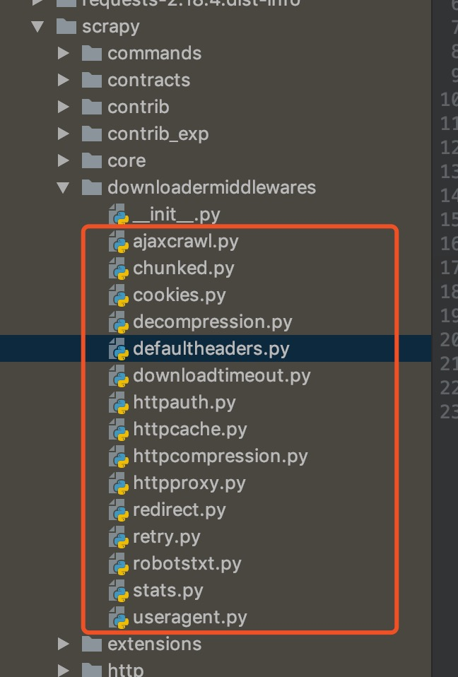

## 
downloader middleware(下载中间件)的认识

> 下载中间件相对于`spider middleware`显得作用更大些,在实际中使用也更加频繁,比如动态设置代理ip,请求头等

### 一、关于`downloader middleware`的认识

* 1、继续参考第八章第二节的图中分析,下载中间件是介于`spider`的`request/respone`处理的钩子框架,是用于**全局**修改`scrapy`的`request`和`respone`,更好的帮助我们定制爬虫。
* 2、使用过程中同样需要在`settings.py`中的`DOWNLOADER_MIDDLEWARES`注册激活
* 3、关于`scrapy`中内置的`downloader middleware`(直接看源码,有点多就不直接引入)

  

### 二、下载中间件中几个重要方法

* 1、下载器中间件主要核心的方法有(只要实现一个或者多个的类就可以叫下载中间件)
  * `process_request(self, request, spider)`
  * `process_response(self, request, respone, spider)`
  * `process_exception(self, request, exception, spider)`
  * `from_crawler(cls, crawler)`(本来不属于这边的,只是我们需要从`settings.py`中获取配置信息)

* 2、`process_request(self, request, spider)`方法

  参数:
  * `request`:发送请求的`request`对象
  * `spider`:发送请求的`spider`对象

  返回值:
  * `Node`:如果返回的是`None`,`scrapy`将执行其他的下载中间件继续处理`request`,
  * `Response`:如果返回是`Response`,`scrapy`将不会调用任何其他的`process_request`方法,直接返回`respone`,且会在已经激活的中间件中的`process_response`中继续调用
  * `Request`:如果返回是`Request`不再使用之前`request`对象去下载数据,而是根据现在返回的`request`对象返回`request`对象返回数据
  * 如果是抛出异常就会执行`process_exception`方法

* 3、`process_response(self, request, respone, spider)`方法
  参数:
  * `request`:`request`对象
  * `respone`:被处理的`respone`对象
  * `spider`: `spider`对象

  返回值

  * 返回`response`对象:会将这个新的`respone`对象传给其它的中间件,最终传给爬虫
  * 返回`request`对象,下载器链(对个下载器串行)就会被切断,返回的`request`会重新被下载器调度下载
  * 如果是抛出异常就会执行`process_exception`方法

* 4、`process_exception(self, request, exception, spider)`方法
  参数:
  * `request`:产生异常的`request`对象
  * `exception`: 异常
  * `spider`: `spider`对象

  返回值:

  * `None`:`scrapy`将会继续执行别的下载中间件
  * 如果返回`Response`对象时,那么已经激活的`process_response`方法会继续执行
  * 如果返回`Request`对象时,那么`request`将会重新调用下载
