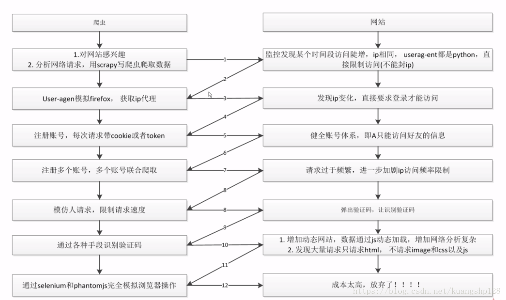

## <center>突破反爬虫策略</center>

### 一、关于爬虫与反爬虫的介绍

  对于一般用户来说,网络爬虫是一个好工具,可以很方便的从网站上获取自己想要的数据,对于网站所有者来说,网络爬虫占用了太多的资源,虽然访问量增加了,但是并没有相对应的增加广告收入。一些企业有价值的东西,更加不希望网络爬虫直接爬取走,所以很多网站都会设置反爬虫策略,来防止网络爬虫抓取数据,不管采用什么方式来限制网络爬虫,只能说限制的是一些初级爬虫,如果我们对爬虫进行改进,赋予更强的功能,更隐蔽的手段,这就展开了爬虫与反爬虫的博弈


  关于爬虫与反爬虫的博弈图

  

### 二、在`scrapy`中突破反爬虫方法

* 1、`DOWNLOAD_DELAY`设置访问频率(单位秒)

  如果网站不限制反爬虫,那么我们就设置越小越好,如果有反爬虫的你需求不是那么着急就设置大点

  ```
  DOWNLOAD_DELAY = 1 # 表示每隔一秒就访问请求一次
  ```

* 2、封锁`Cookies`的破解

  ```py
  ROBOTSTXT_OBEY = False
  ```

* 3、封锁`user-agent`的破解,直接使用下载中间件随机取一个请求头
* 4、封装`IP`的破解,直接代理`IP`,或者搭建属于自己的`IP`代理池
* 5、费时费力的就是多养几个号
