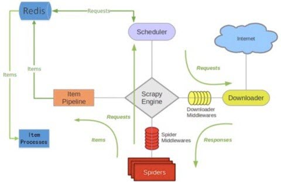
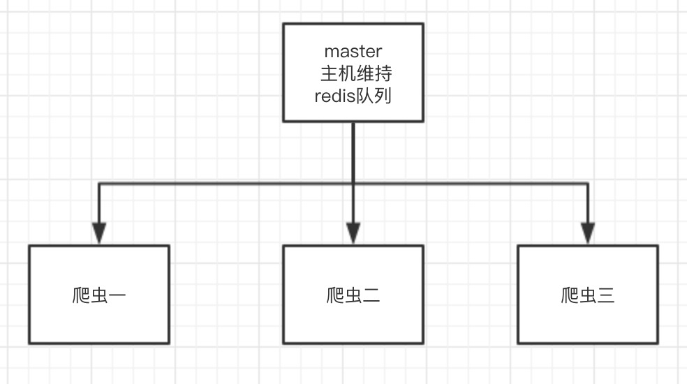

## <center>scrapy-redis架构</center>

### 一、关于`scrapy-redis`的架构图

* 1、图解

  

* 2、`scrapy-redis`就是建立在`scrapy`的基础上,使用`redis`做队列来取代单机爬虫中的`request`队列

### 二、分布式爬虫项目架构

* 1、最少需要两台电脑来部署
* 2、基本架构

  


### 三、如果书写一个分布式爬虫

> 首先先写好单机爬虫,分布式爬虫都是建立在单机爬虫的基础上修改而成的。现在就当你已经写好了单机爬虫

* 1、安装包

  ```py
  pip3 install scrapy-redis
  ```

* 2、将爬虫的类从`scrapy.Spider`变成`scrapy_redis.spiders.RedisSpider`;或者是从`scrapy.CrawlSpider`变成`scrapy_redis.spiders.RedisCrawlSpider`。

  ```py
  from scrapy_redis.spiders import RedisSpider

  class BlogSpider(RedisSpider):
      pass
  ```

* 2、将爬虫中的`start_urls`删掉。增加一个`redis_key="xxx"`。这个`redis_key`是为了以后在`redis`中控制爬虫启动的。爬虫的第一个`url`,就是在`redis`中通过这个发送出去的。

  ```py
  class BlogSpider(RedisSpider):
      name = 'blog'
      allowed_domains = ['blog.jobbole.com', 'python.jobbole.com']
      # start_urls = ['http://python.jobbole.com/all-posts/']
      redis_key = 'blog:start_urls'
  ```

* 3、在`settings.py`文件中修改

  ```py
  # Scrapy-Redis相关配置
  # 确保request存储到redis中
  SCHEDULER = "scrapy_redis.scheduler.Scheduler"

  # 确保所有爬虫共享相同的去重指纹
  DUPEFILTER_CLASS = "scrapy_redis.dupefilter.RFPDupeFilter"

  # 设置redis为item pipeline
  ITEM_PIPELINES = {
      'scrapy_redis.pipelines.RedisPipeline': 300
  }

  # 在redis中保持scrapy-redis用到的队列，不会清理redis中的队列，从而可以实现暂停和恢复的功能。
  SCHEDULER_PERSIST = True

  # 设置连接redis信息
  # REDIS_HOST = '127.0.0.1'
  # REDIS_PORT = 6379
  REDIS_URL = 'redis://username:password@Ip地址:6379'
  ```

* 4、启动爬虫
  * 进入项目目录中的`spider`文件夹下运行下面命令

    ```py
    scrapy runspider [爬虫名字文件]
    ```

  * 将开始的`url`地址推送过去

    ```py
    redis-cli -h ip地址 -a 密码
    redis-cli> lpush [redis_key] start_url 开始爬取的url地址。
    ```
