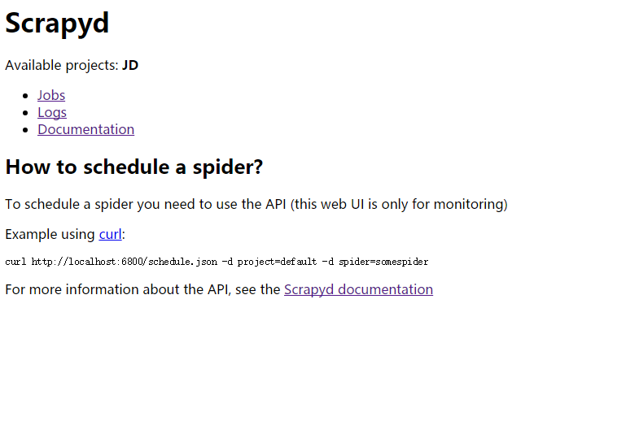
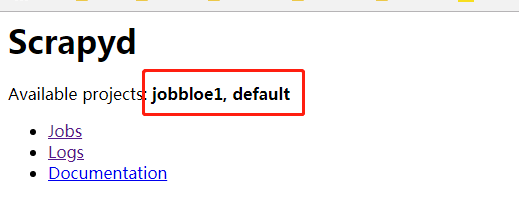

## <center>使用scrapyd部署项目</center>

> 本章节的前提是前面的一切都顺利的能跑的情况下

### 一、安装包

* 1、安装包`scrapyd`

    ```py
    pip3 install scrapyd
    ```

* 2、安装包

    ```py
    pip3 install scrapyd-client
    ```

### 二、测试安装的`scrapyd`是否成功

* 1、直接在终端输入

    ```py
    scrapyd
    ```
* 2、启动后的直接在网页上输入`localhost:6800`,如果是服务器上就输入**域名:6800**(可能会报无访问权限,修改文件配置信息)

    ```py
    # 在你的跑scrapy的空间(crawl_env)查找到scrapyd的文件夹下default_scrapyd.conf
    /var/env/crawl_env/lib/python3.4/site-packages/scrapyd#
    #修改这个为bind_address = 0.0.0.0
    bind_address = 127.0.0.1
    ```

* 3、在客户端浏览器输入`域名:6800`可以看到

    

### 三、部署项目

* 1、修改项目下`scrapy.cfg`文件(放开`url`前面的注释就可以)

    ```py
    [deploy:jobbloe1]
    url = http://localhost:6800/
    project = jobbloe1
    ```

* 2、在`cfg`文件位置

    ```py
    scrapyd-deploy jobbloe1(上面的deploy名) -p jobbloe1(上面的项目名)
    ```

* 3、上面输出会在黑窗口中显示

    ```py
    Packing version 1538630801
    Deploying to project "jobbloe1" in http://localhost:6800/addversion.json
    Server response (200):
    {"project": "jobbloe1", "version": "1538630801", "status": "ok", "node_name": "iZ941w016mwZ", "spiders": 1}

    ```

* 4、刷新浏览器会显示

    

* 5、启动爬虫

    ```py
    # 如果是非本服务器上启动就输入域名
    curl http://localhost:6800/schedule.json -d project=jobbloe1 -d spider=jobbloe1
    ```

* 6、查看启动爬虫及日志文件
* 7、启动爬虫会生成一个提示的串号

    ```py
    {"status": "ok", "node_name": "iZ941w016mwZ", "jobid": "9b4d079ac79611e8b96600163e0004a4"}
    ```


### 四、其它命令

* 1、取消爬虫

    ```py
    curl http://localhost:6800/cancel.json -d project=myproject -d job=jobid
    ```

* 2、列出你部署的爬虫

    ```py
    curl http://localhost:6800/listprojects.json
    ```
